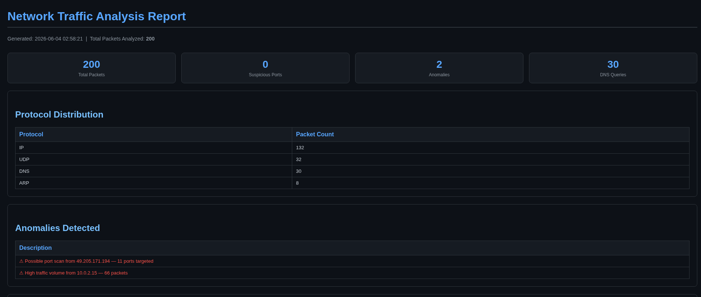
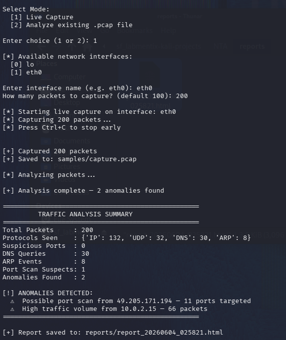
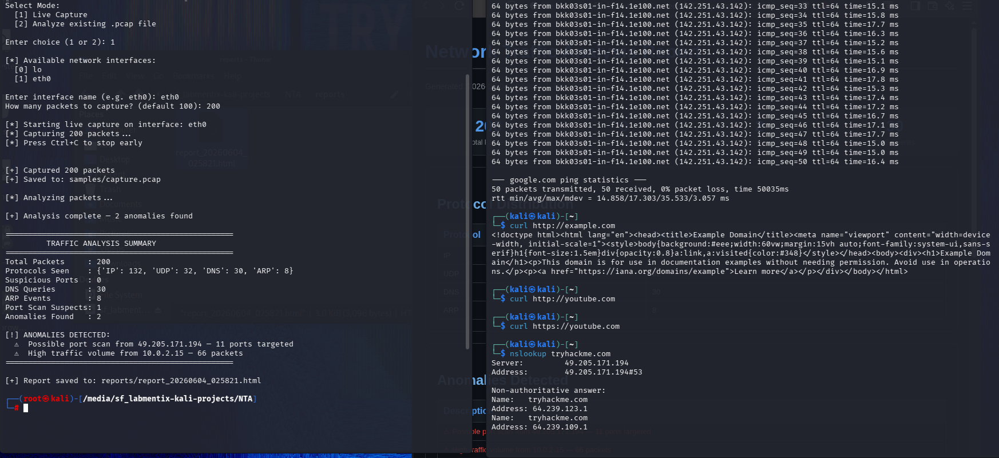

# Network Traffic Analyzer

A Python-based network traffic analysis tool built on Kali Linux using Scapy. Captures live packets from a network interface, performs protocol-level analysis, detects anomalies like port scans and suspicious port access, and generates a dark-themed HTML report of all findings.



---

## Features

- **Live packet capture** on any network interface using Scapy
- **Protocol analysis** across IP, TCP, UDP, DNS, and ARP layers
- **Port scan detection** — flags any IP accessing more than 10 unique ports
- **Suspicious port detection** — alerts on known dangerous ports (Metasploit 4444, RDP 3389, Telnet 23, SMB 445, and more)
- **High traffic anomaly detection** — flags IPs sending unusually high packet volumes
- **DNS query logging** — captures every domain lookup made during the capture window
- **HTML report generation** — timestamped dark-themed report saved automatically to `reports/`
- **Dual mode** — run live capture or analyze an existing `.pcap` file

---

## Screenshots

### Terminal Summary Output


### Generated HTML Report

### Two-Terminal Capture Setup


---

## Project Structure

```
network-traffic-analyzer/
│
├── main.py          # Entry point — presents menu and orchestrates the workflow
├── capture.py       # Packet capture using Scapy sniff() and pcap read/write
├── analyzer.py      # Protocol analysis and anomaly detection engine
├── report.py        # HTML report generator
│
├── samples/         # Captured .pcap files are saved here
└── reports/         # Generated HTML reports are saved here
```

---

## Requirements

- Kali Linux (or any Debian-based Linux distro)
- Python 3.x
- Root / sudo access (required for packet capture)

### Python Dependencies

All packages come pre-installed on Kali Linux 2026.x. For other systems:

```bash
pip3 install scapy --break-system-packages
```

Verify your setup:

```bash
python3 -c "import scapy; print(scapy.__version__)"
wireshark --version
```

---

## Usage

### Clone the Repository

```bash
git clone https://github.com/AtsushiakaRaju/network-traffic-analyzer.git
cd network-traffic-analyzer
```

### Run the Analyzer

```bash
python3 -c "from main import main; main()"
```

> **Note:** Must be run as root inside Kali Linux for live packet capture to work.

### Option 1 — Live Capture

```
Select Mode:
  [1] Live Capture       ← choose this
  [2] Analyze existing .pcap file

Enter choice: 1
Enter interface name (e.g. eth0): eth0
How many packets to capture? (default 100): 200
```

While the capture is running, open a second terminal and generate traffic:

```bash
ping google.com -c 50
curl http://example.com
nslookup google.com
nslookup github.com
nslookup tryhackme.com
```

### Option 2 — Analyze Existing .pcap File

```
Select Mode:
  [2] Analyze existing .pcap file

Enter path to .pcap file (default: samples/capture.pcap): samples/capture.pcap
```

### View the Report

After capture completes, open the generated HTML report in a browser:

```bash
firefox reports/report_*.html
```

---

## Anomaly Detection Logic

| Detection Type | Trigger Condition |
|---------------|-------------------|
| Port Scan | Single IP accesses more than 10 unique destination ports |
| Suspicious Port | TCP/UDP packet destined for a known dangerous port |
| High Traffic Volume | Single IP sends more than 50 packets in the capture window |
| DNS Query Log | All DNS lookups are recorded regardless of volume |

### Monitored Suspicious Ports

| Port | Service |
|------|---------|
| 22 | SSH |
| 23 | Telnet |
| 25 | SMTP |
| 445 | SMB |
| 3389 | RDP |
| 4444 | Metasploit |
| 6667 | IRC / Backdoor |
| 1337 | Common hacker port |

---

## Sample Output

```
==================================================
         TRAFFIC ANALYSIS SUMMARY
==================================================
Total Packets     : 200
Protocols Seen    : {'IP': 132, 'UDP': 32, 'DNS': 30, 'ARP': 8}
Suspicious Ports  : 0
DNS Queries       : 30
ARP Events        : 8
Port Scan Suspects: 1
Anomalies Found   : 2

[!] ANOMALIES DETECTED:
  ⚠  Possible port scan from 49.205.171.194 — 11 ports targeted
  ⚠  High traffic volume from 10.0.2.15 — 66 packets
==================================================

[+] Report saved to: reports/report_20260604_025821.html

```

---

## How It Works

Scapy intercepts every packet flowing through the network interface and exposes it as a Python object with layered attributes. The analyzer reads each layer individually:

```python
if packet.haslayer(IP):
    src = packet[IP].src          # source IP
    dst = packet[IP].dst          # destination IP

if packet.haslayer(TCP):
    dport = packet[TCP].dport     # destination port
    ip_ports[src].add(dport)      # track unique ports per IP

if packet.haslayer(DNS):
    query = packet[DNSQR].qname   # DNS domain queried
```

Port scan detection uses `defaultdict(set)` — since sets only store unique values, accessing the same port 100 times still counts as 1. When the unique port count for any IP exceeds the threshold of 10, it's flagged automatically.

---

## Known Limitations

- Requires root access — standard user accounts cannot access raw network sockets
- Running from a shared folder mount (`/media/sf_*`) may cause stdin issues — copy the project to a local path if so
- Live capture on a NAT network interface (VirtualBox default) only sees traffic to/from the VM, not host-to-host traffic
- The `--break-system-packages` flag is needed on Kali 2026.x if installing packages via pip3

---

## Disclaimer

This tool is intended for **educational purposes and authorized network monitoring only**. Do not run packet capture on networks you do not own or have explicit permission to monitor. Unauthorized network interception may violate local laws.

---

*Built as part of the Labmentix Cybersecurity Internship — Network Security domain.*